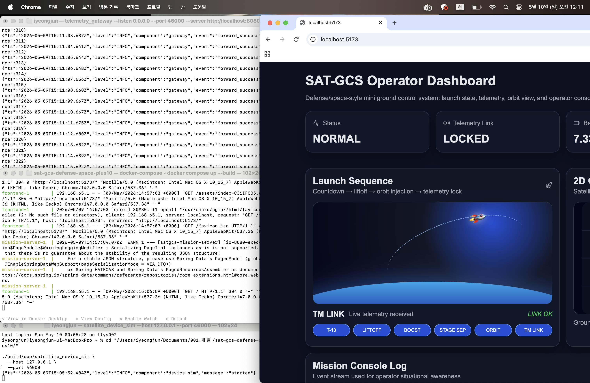
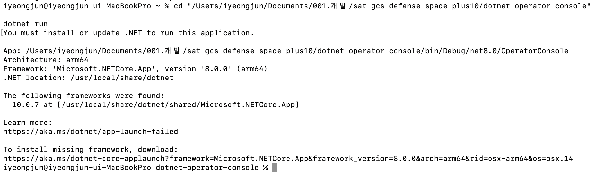

# SAT-GCS Ground Control Portfolio

Mini satellite ground control portfolio project focused on telemetry ingestion, gateway processing, mission server design, operator tooling, and verification documentation.

This project does not claim to be certified satellite or defense software.  
It was built to demonstrate how a ground-control-style system can be structured across protocol handling, backend ingestion, operator visualization, and verification artifacts.

---

## Key Technologies

`C++` `UDP` `CRC32` `Spring Boot` `React` `C#` `Python`  
`Telemetry` `Mission Server` `Operator Dashboard` `Verification`

---

## Production-Oriented Improvements

This version includes operational and reliability-focused improvements:

- C++ POSIX HTTP client instead of shelling out to `curl`
- Gateway timeout, retry logic, and bounded queue
- Graceful shutdown with `SIGINT` / `SIGTERM`
- Structured JSON logs with millisecond timestamps
- Fault-injection UDP test tool
- Expanded RTM / SRS / VTP traceability
- IDE and run command guide: `docs/IDE_AND_RUNBOOK.md`
- Career level guide: `docs/CAREER_LEVEL_GUIDE.md`

---

## Architecture

```text
[C++ Satellite Device Simulator]
    UDP binary telemetry + CRC32
        ↓
[C++ Telemetry Gateway]
    size / magic / version / CRC validation
    retry queue
    JSON forwarding
        ↓ HTTP + API Key
[Java Spring Boot Mission Server]
    validation / persistence / alerting / health check
        ↓
[React Dashboard]      [C# Operator Console]
        ↑
[Python Replay / Load / Schema Tools]
```

---

## Why This Project Exists

The goal is to connect hardware-production experience with ground-system software.

This project connects the following areas:

- PCB / Gerber / BOM / datasheet / material-flow experience
- device-side telemetry generation
- binary protocol handling
- telemetry ingestion
- gateway and mission server design
- operator-facing monitoring
- verification and traceability documentation

---

## Engineering-Oriented Features

This project is more than a simple CRUD or dashboard application because it includes:

- Binary UDP telemetry packet instead of plain JSON device data
- CRC32 packet integrity check
- Explicit decode error status in C++
- Gateway timeout and retry behavior
- Bounded retry queue
- Mission server API key boundary
- DTO validation and DB migration
- Health check endpoint
- Replay, load, and schema tools
- Requirements traceability matrix
- Interface Control Document
- Verification Test Plan

---

## Key Documents

| Document | Purpose |
|---|---|
| `docs/SRS.md` | Software requirements |
| `docs/ICD.md` | UDP / HTTP interface control |
| `docs/SDD.md` | Software design description |
| `docs/VTP.md` | Verification test plan |
| `docs/VTR.md` | Verification report template |
| `docs/RTM.md` | Requirements traceability matrix |
| `docs/CODING_STANDARD.md` | Lightweight coding standard profile |
| `docs/RISK_REGISTER.md` | Risk and mitigation table |
| `docs/OPERATIONS_RUNBOOK.md` | Build, run, and fault-handling guide |
| `docs/SECURITY_NOTES.md` | Security boundary and production extensions |
| `docs/PORTFOLIO_GUIDE.md` | Interview explanation guide |
| `docs/INTERVIEW_NOTES.md` | Interview talking points |
| `docs/FAULT_INJECTION.md` | Fault-injection scenarios |
| `docs/RUN_RESULT.md` | Run verification template |

---

## Quick Start

```bash
cp .env.example .env
docker compose up --build
```

Dashboard:

```text
http://localhost:5173
```

Mission server health:

```bash
curl http://localhost:8080/actuator/health
```

---

## Build and Run C++ Layer

```bash
make cpp-build
make cpp-test

./build/cpp/telemetry_gateway \
  --listen 0.0.0.0 \
  --port 46000 \
  --server http://localhost:8080 \
  --api-key dev-api-key

./build/cpp/satellite_device_sim \
  --host 127.0.0.1 \
  --port 46000
```

---

## Run Python Replay Tool

```bash
cd python-tools
python -m venv .venv
. .venv/bin/activate
pip install -r requirements.txt

python telemetry_replay.py \
  --api http://localhost:8080 \
  --api-key dev-api-key \
  --file sample_telemetry.jsonl
```

---

## Screenshots

> Add real screenshots after local verification.  
> Do not leave broken image links in the final portfolio version.

Recommended files:

```text
assets/screenshots/dashboard.png
assets/screenshots/telemetry.png
assets/screenshots/operator-console.png
```

Once screenshots are added, enable the section below:

```md





```

---

## Honest Limits

This project does **not** claim:

- real CCSDS / ECSS full implementation
- real satellite flight software
- certified defense or aerospace compliance
- hardware-in-the-loop validation
- formal timing analysis
- production-grade mission security

---

## Interview Wording

> This is not certified mission software.  
> I built it to study how ground-control-style systems are structured: requirements, ICD, C++ protocol layer, gateway processing, mission server, operator tools, and verification traceability.

---

## Future Improvements

- Add real hardware telemetry source
- Add stronger authentication and authorization
- Add packet replay protection
- Add integration test automation
- Add dashboard screenshots and execution GIF
- Add timing and latency measurement report
- Add CI workflow for C++ / Java / React checks
